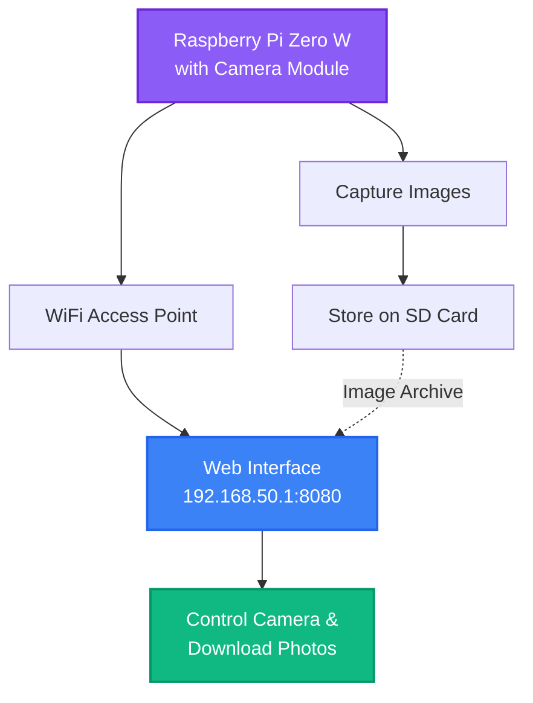

# Go Raspberry Pi Timelapse

This repository contains documentation and source code to help running a [Raspberry Pi Zero](https://www.raspberrypi.org/products/raspberry-pi-zero-w/) based timelapse camera.

## How does it work?

**System Overview:**
1. 🎥 Raspberry Pi Zero W with Camera Module captures images at scheduled intervals
2. 💾 Images are stored locally on the SD card
3. 📡 Pi creates a WiFi hotspot for wireless access
4. 🌐 Built-in web interface for camera control, preview, and image downloads
5. ⏰ Automated scheduling for hands-free operation

## Parts List

<b>Click to expand Parts List</b>

This project was created for a timelapse system consisting of the following core components: a Pi Zero W with a camera board, a case, and an SD card. The following sections describe the components in more detail.

### Core parts for regular deployment (about $65)

* [Raspberry Pi Zero W](https://www.adafruit.com/product/3400) ($10)
* [Raspberry Pi Camera Board v2](https://www.adafruit.com/product/3099) ($30)
* [Raspberry Pi Zero Camera Cable](https://www.adafruit.com/product/3157) ($6)
* [C4Labs Zebra Zero Case](https://www.adafruit.com/product/3003) ($7)
* [microSDHC Card](https://www.adafruit.com/product/2767) ($12)

### Additional parts to include a battery backed clock (about $8)

* [Break-away 0.1" 2x20-pin Strip Dual Male Header](https://www.adafruit.com/product/2822) ($1)
* [CR1220 12mm Diameter - 3V Lithium Coin Cell Battery](https://www.adafruit.com/product/380) ($1)
* [Adafruit PiRTC - PCF8523 Real Time Clock for Raspberry Pi](https://www.adafruit.com/product/3386) ($6)

### Additional Parts for Development (about $6)

* [USB OTG Host Cable - MicroB OTG male to A female](https://www.adafruit.com/product/1099) ($3)
* [Mini HDMI Plug to Standard HDMI Jack Adapter](https://www.adafruit.com/product/2819) ($3)

## Build overview

<b>Click to expand Build Steps</b>

### Build steps

#### Step 1: Initial Build

1. Optional: If you want to use the battery backed clocked start by soldering the 2x20-pin strip on Pi Zero W board ([instructions](https://learn.adafruit.com/adding-a-real-time-clock-to-raspberry-pi/wiring-the-rtc)). After the soldering, attach the RTC to the 2x20-pin strip. Don't forget to insert the CR1220 battery into the RTC. 
2. Connect the Pi Zero W and the Pi Camera Board v2 via the Pi Zero Camera cable.
3. Insert the Pi Zero W into the C4Labs Zerbra Zero Case.

#### Step 2: Install disk image and access web interface

1. From another computer, download, and decompress the `.img` file of the [most recent go-raspberry-pi-timelapse release](https://github.com/ingojaeckel/go-raspberry-pi-timelapse/releases).
2. Install the `.img` file to an empty SD card using the [Raspberry Pi Imager](https://www.raspberrypi.org/software/).
3. Insert the SD card card into the Pi Zero W.
4. Turn on the Pi Zero W plugging in a micro USB cable into the PWR IN connector (bottom right corner).
5. The Pi Zero W will act as a Wifi access point. Connect to the Pi's Wifi named `timelapse-raspberry-pi`, passphrase: `InsertTheRealPassword`.
6. Open the Pi's web interface in a browser: `http://192.168.50.1:8080/`. This interface will allow you to align the camera, download photos, shutdown the Pi, etc.

<b>Misc resources</b>

## PiTFT
* https://learn.adafruit.com/adafruit-pitft-28-inch-resistive-touchscreen-display-raspberry-pi/easy-install-2 - Follow steps and `PiTFT as HDMI Mirror (Best for Raspberry Pi OS with Desktop)`
* https://learn.adafruit.com/running-opengl-based-games-and-emulators-on-adafruit-pitft-displays/tuning-performance
* https://willhaley.com/blog/power-off-raspberry-pi-adafruit-tft-screen-shutdown/
* Streaming raspivid output via network. (1) on the receiving device: `vlc -vvv udp://@:1234 :demux=h264`. (2) on the Pi: `raspivid -t 60000 -o udp://192.168.0.123:1234`.

---

## 🔬 Experimental: C++ Object Detection

<b>Click to expand C++ Object Detection details</b>

This repository also includes an experimental C++ application for real-time object detection, located in the [`cpp-object-detection/`](cpp-object-detection/) directory.

### Purpose & Comparison

| Feature | Go Timelapse (Main Project) | C++ Object Detection (Experimental) |
|---------|----------------------------|-------------------------------------|
| **Primary Purpose** | Scheduled timelapse photography | Real-time object detection & tracking |
| **Hardware Target** | Raspberry Pi Zero W | Higher-performance systems (Pi 4, desktop) |
| **Camera Input** | Pi Camera Module (CSI) | USB webcams |
| **Processing** | Minimal - just capture images | AI/ML object detection (YOLO) |
| **Resource Usage** | Very low power | Higher CPU/memory requirements |
| **Output** | Scheduled still images | Continuous detection logs & optional images |
| **Use Cases** | Time-lapse videos, construction monitoring | Security monitoring, wildlife observation |
| **Maturity** | Production-ready | Experimental/Research |

### Key Features of C++ Object Detection

- **Real-time detection** using YOLO models at 720p
- **Object tracking** with movement detection
- **Network streaming** via MJPEG
- **Headless operation** for embedded systems
- **GPU acceleration** support (CUDA/OpenCL)
- **Smart photo storage** - only saves images when objects are detected
- **Long-term operation** optimized for continuous 24/7 deployment

### Getting Started

For more information about the C++ object detection application, see the [cpp-object-detection/README.md](cpp-object-detection/README.md).

**Note:** The C++ application is experimental and designed for different use cases than the main timelapse project. It requires more powerful hardware and has different dependencies (OpenCV, ONNX runtime).

---
