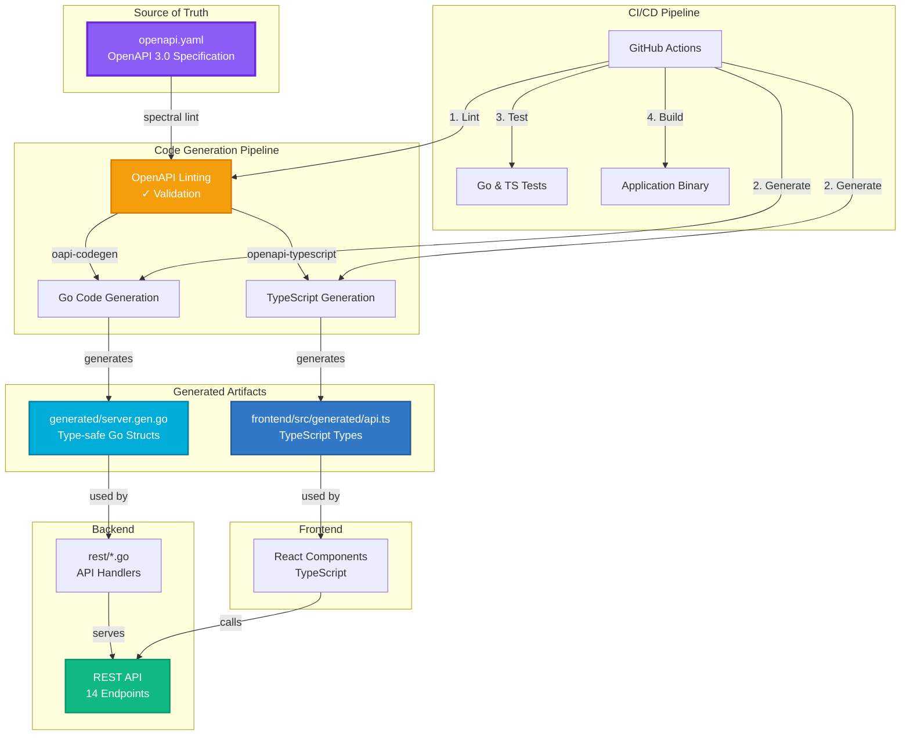

# OpenAPI Architecture Overview



## Key Components

### 1. OpenAPI Specification (`openapi.yaml`)
**Single source of truth** defining:
- 14 API endpoints with paths, methods, parameters
- Request/response schemas
- Data models (Settings, MonitoringResponse, Photo, etc.)
- Validation rules and constraints

### 2. Code Generation Tools

#### Spectral (OpenAPI Linting)
- Validates OpenAPI spec against best practices
- Catches errors early in development
- Runs automatically in CI/CD

#### oapi-codegen (Go)
- Generates type-safe Go structs
- Creates models matching OpenAPI schemas
- Embeds spec for documentation

#### openapi-typescript (TypeScript)
- Generates TypeScript type definitions
- Ensures frontend/backend type consistency
- Enables IDE autocomplete

### 3. Integration Points

#### Backend (Go)
```go
import "github.com/ingojaeckel/go-raspberry-pi-timelapse/generated"

func handler(w http.ResponseWriter, r *http.Request) {
    var settings generated.Settings  // Type-safe!
    // ... handler logic
}
```

#### Frontend (TypeScript)
```typescript
import { components } from './generated/api';

type Settings = components['schemas']['Settings'];
// Type-safe API interactions
```

## Workflow

### Development
```bash
# 1. Edit OpenAPI spec
vim openapi.yaml

# 2. Validate and generate code
make generate

# 3. Update handlers/components
# (Use generated types)

# 4. Test
make test

# 5. Build
make build
```

### CI/CD Automation
1. **Lint** - Validate OpenAPI spec
2. **Generate** - Create Go & TypeScript code
3. **Build** - Compile frontend & backend
4. **Test** - Run all test suites
5. **Deploy** - Package application

## Benefits

✅ **Type Safety** - Compile-time checking prevents type errors  
✅ **Consistency** - Frontend/backend always in sync  
✅ **Documentation** - OpenAPI spec serves as API docs  
✅ **Automation** - Code generation reduces manual work  
✅ **Validation** - Catches issues before deployment  

## API Endpoints Overview

| Endpoint | Method | Purpose |
|----------|--------|---------|
| `/version` | GET | Application version |
| `/capture` | GET | Capture preview photo |
| `/configuration` | GET/POST/OPTIONS | Configuration management |
| `/monitoring` | GET | System monitoring data |
| `/logs` | GET | Application logs |
| `/photos` | GET | List photos with metadata |
| `/file` | GET | List all files |
| `/file/last` | GET | Most recent file |
| `/file/{fileName}` | GET | Download specific file |
| `/file/delete` | GET | Delete files |
| `/archive/zip` | GET | ZIP archive download |
| `/archive/tar` | GET | TAR archive download |
| `/admin/{command}` | GET | Admin operations |

All endpoints are fully documented in `openapi.yaml` with:
- Request parameters and body schemas
- Response codes and schemas
- Descriptions and examples
